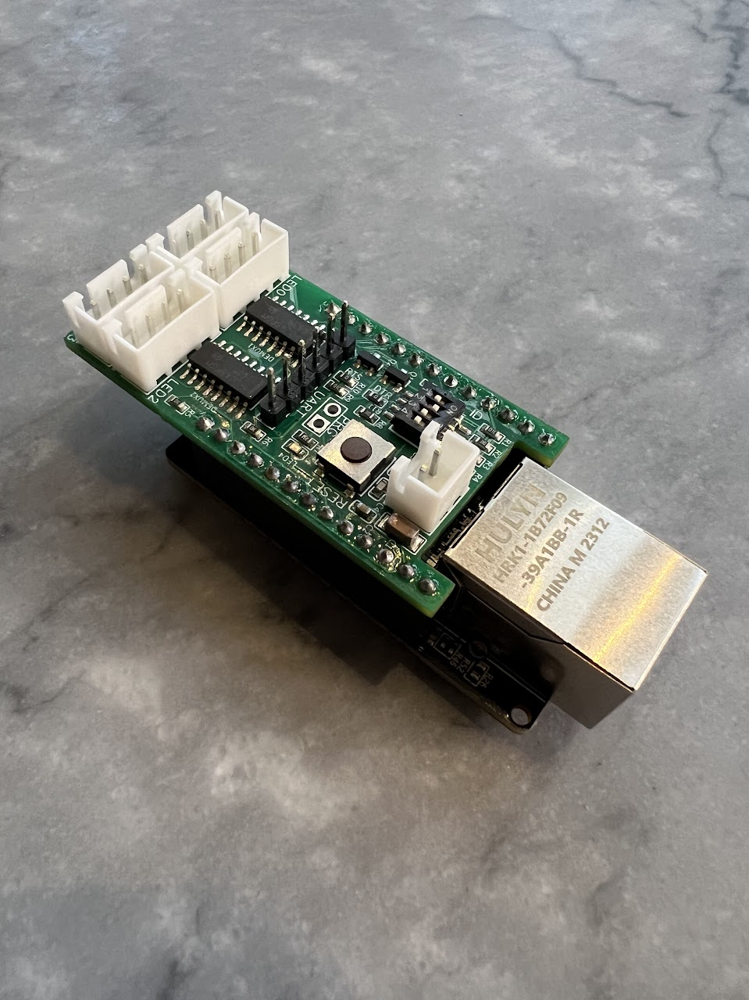
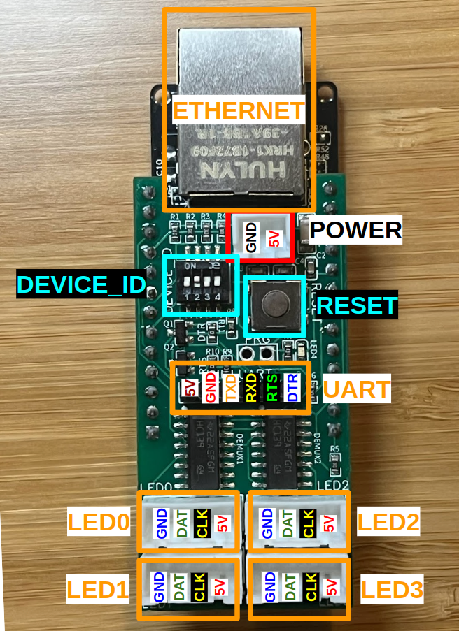
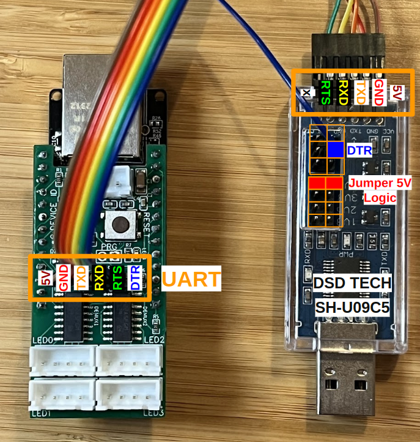

# Starpusher

A Starpusher controls 4 x strips of APA102 LEDs (up to 420 LEDs per strip), taking LED information via UDP ethernet packets. We've tested it to run 4 x 420 LED strips at 60FPS with no glitches.

A Starpush comprises a [WT32 ETH01](https://www.amazon.com/EC-Buying-WT32-ETH01-Development-Bluetooth/dp/B09Z298QJQ/ref=sr_1_5?crid=121WYGGG1S6LG&keywords=wt32+eth01&qid=1688881692&s=electronics&sprefix=wt32+eth01%2Celectronics%2C306&sr=1-5) with a custom-designed Starshield. The Starshield has a DIP switch that configures the Static IP address a given Starpusher uses and has headers for 4 LED strips.

See the comments in [main/starpusher.c](main/starpusher.c) for a codebase guide.

## Development Environment
Starshield code is built using the esp-idf toolchain.

1. Follow the steps in the [Standard Toolchain Setup Guide](https://docs.espressif.com/projects/esp-idf/en/latest/esp32/get-started/linux-macos-setup.html#get-started-configure),
2. Activate the esp-idf environment in a terminal (typically `$ get_idf` after following the setup guide,
3. Build the codebase `$ idf.py build`,
4. Connect your Starshield PCB to a WT32 ETH01 base board,
5. Connect a USB UART to the UART header on the Starshield,
6. Flash the Starpusher code onto the WT32 ETH01 by running `$ idf.py -p /dev/ttyUSB0 flash`
7. Monitor the WT32 ETH01's logs by running `$ idf.py -p /dev/ttyUSB0 monitor`

## REQUIRED: Configuring a new WT32 ETH01 for Starshield use
By default, on bootup, an ESP32 uses the value of pin IO12 to determine SPI Flash chip voltage. It has an internal pull-down so defaults to low (3.3V flash chip). If held high during bootup, then ESP32 treats Flash Chip voltage as 1.8V.

On our board we have a pull-up on IO12 since it's used to set the device ID via dip switch. The fix is to blow an eFuse on the ESP32 that fixes Flash chip voltage to 3.3v.

Do the following:

1. Set all dip switches on the ON position (this pulls IO12 low so it will actually boot), 
2. Run the following command to permanently burn the eFuse governing flash voltage so it's forced to 3.3V
   \
   `$ espefuse.py --do-not-confirm --port /dev/ttyUSBx set_flash_voltage 3.3V`
   \
   Replacing `/dev/ttyUSBx` with the port of your USB tty.

## Starshield

Schematics, gerber, BOM, and pick-and-place data for the Starshield V2 is in the `starshield` sub-folder.

### Board Overview

### UART

The WT32 ETH01 that the Starshield sits sits on can be progammed via a USB UART (all development was done with a [DSD TECH SH-U09C5](https://www.amazon.com/gp/product/B07WX2DSVB/)) which has RTS and DTR pins so that ESP-IDF can program the ESP32 without having to manually fiddle with jumpers / manual resets.

